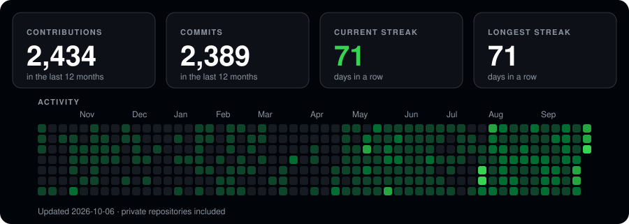

# Wiktor

Full-stack developer. I build fast, focused web products — few features, done well.

Next.js · TypeScript · Supabase · Tailwind · Node.js · Python · Flutter

  

---

## Selected work

| Project | What it is | Stack |
|---|---|---|
| **[Polecajki](https://polecajkiszalony.wermis.space)** | Curated gaming gear recommendations (keyboards, mice, mousepads) filtered by budget and grip type, with affiliate links. | Next.js, TypeScript |
| **[Championsy](https://szalonychampions.vercel.app)** | Watchparty hub for Valorant Champions Shanghai 2026 — group and playoff brackets, winner predictions, fan profiles. | Next.js, TypeScript, Supabase |
| **[Projekt Radiant](https://projektradiant.pl)** | Landing page for Valorant streamer HossyFPS: duo applications and Radiant-themed branding, in Polish. | Next.js 16, React 19, Tailwind v4, Framer Motion |
| **[JustTrackVal](https://jtv.wermis.space)** | Minimal Valorant stats tracker: rank, act overview, recent form, match history. | Next.js, Tailwind, TypeScript |
| **[GridTV](https://gridtv.wermis.space)** | F1 pit-wall app: live sessions, race calendar, standings and lap-by-lap replays. | Vite, React 19 |

Earlier: [Watchiru](https://github.com/wermisek/Watchiru) (anime search), [HelpDeskFlutter](https://github.com/wermisek/HelpDeskFlutter) (school IT ticketing), [StocksPredictor](https://github.com/wermisek/StocksPredictor) (LSTM forecasting).

Source for most recent work is private — the live links above are the best way to see it.

---

## Stack

- **Frontend** — React, Next.js, TypeScript, Tailwind CSS, Vite
- **Backend** — Node.js, Supabase (Postgres, Auth), REST APIs
- **Mobile / desktop** — Flutter, Electron
- **Other** — Python, Git, Vercel, Cloudflare

---

## Contact

[Twitch](https://www.twitch.tv/wermisek) · [Instagram](https://instagram.com/wermisek) · Discord: `wermis`
